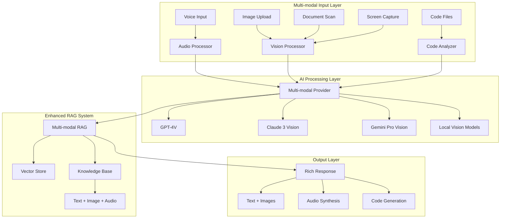

# Kate LLM Client - Multi-modal AI Integration Plan

**Version**: 1.0  
**Date**: August 17, 2025  
**Status**: Architecture Phase - Ready for Implementation

## Executive Summary

This plan outlines the transformation of Kate LLM Desktop Client into a comprehensive multi-modal AI workstation. Building on Kate's existing enterprise-grade foundation with advanced RAG capabilities, we will add vision processing, audio interactions, and intelligent code analysis to create a truly multimedia AI assistant.

## Current Foundation Assessment

### ✅ Strong Existing Capabilities

- **Advanced RAG System**: 12/16 tasks completed with vector database, semantic search
- **Enterprise Architecture**: 24-component framework with async patterns
- **Modern UI**: 3-column PySide6 interface with professional theming
- **Multi-Provider LLM**: OpenAI, Anthropic, Ollama, Gemini, Groq support
- **Document Processing**: PDF, DOCX, OCR capabilities already implemented
- **Multimedia Dependencies**: Extensive ML/AI libraries already in pyproject.toml

### 🔄 Current Work (RAG Integration)

- Chat system integration (Task 13/16)
- Progress indicators (Task 14/16)
- Evaluation metrics (Task 15/16)
- Comprehensive testing (Task 16/16)

## Multi-modal AI Architecture



## Implementation Roadmap

### Phase 1: Foundation & Database (Task 17)

**Timeline**: 1 week  
**Goal**: Extend Kate's data layer to handle multi-modal content

**Key Components**:

- Extend `FileAttachment` model for multi-modal metadata
- Add `MediaContent` table for images, audio, video
- Create `VisualEmbedding` and `AudioEmbedding` tables
- Add content type validation and processing flags

**Deliverables**:

- Updated database schema with migration scripts
- Extended models in `app/database/models.py`
- Multi-modal content type definitions

### Phase 2: Core Processing Services (Tasks 18-21)

**Timeline**: 3 weeks  
**Goal**: Build the AI processing backbone

#### Task 18: Vision Processing Service

- Image analysis and understanding
- Enhanced OCR with layout detection
- Visual content extraction and metadata
- Integration with existing document processor

#### Task 19: Multi-modal Provider Extensions

- GPT-4V integration for image understanding
- Claude 3 Vision API implementation
- Gemini Pro Vision support
- Local vision model support (CLIP, BLIP)

#### Task 20: Audio Processing Pipeline

- Speech-to-text with Whisper integration
- Audio analysis and transcription
- Voice synthesis with multiple TTS engines
- Audio format support and streaming

#### Task 21: Code Analysis Service

- Syntax highlighting and parsing
- Static analysis and linting
- AI-powered code explanations
- Integration with existing RAG system

### Phase 3: User Interface Enhancement (Tasks 22-24)

**Timeline**: 2 weeks  
**Goal**: Create intuitive multi-modal interactions

#### Task 22: Multi-modal Message Bubbles

- Rich message display with embedded media
- Image gallery and zoom functionality
- Audio playback controls and waveforms
- Code syntax highlighting with execution results

#### Task 23: Drag-and-Drop Interface

- Universal drag-drop for all content types
- Preview thumbnails and metadata display
- Progress indicators for processing
- Batch upload and processing

#### Task 24: Voice Chat Capabilities

- Real-time voice input and transcription
- Push-to-talk and continuous modes
- Voice activity detection
- Audio streaming and buffering

### Phase 4: Advanced Features (Tasks 25-29)

**Timeline**: 4 weeks  
**Goal**: Sophisticated multi-modal capabilities

#### Task 25: Visual Content Search

- CLIP-style embeddings for images
- Visual similarity search
- Cross-modal search (text-to-image)
- Visual content tagging and organization

#### Task 26: Code Execution Sandbox

- Secure Docker-based execution environment
- Multiple language support
- Resource limiting and timeout handling
- Security isolation and validation

#### Task 27: Screen Capture and Analysis

- Screenshot capture functionality
- Screen recording and analysis
- UI element detection and description
- Automated documentation generation

#### Task 28: Chart and Diagram Understanding

- Chart data extraction and analysis
- Diagram interpretation and description
- Flow chart and mind map processing
- Mathematical formula recognition

#### Task 29: Audio Visualization

- Waveform display and editing
- Spectrogram analysis
- Audio feature extraction
- Music and speech classification

### Phase 5: Intelligent Integration (Tasks 30-32)

**Timeline**: 3 weeks  
**Goal**: Advanced AI workflows

#### Task 30: Multi-modal RAG

- Combined text, image, and audio context
- Cross-modal retrieval and ranking
- Contextual understanding across modalities
- Adaptive context selection

#### Task 31: Real-time Collaboration

- Multi-user multi-modal sessions
- Shared canvases and workspaces
- Real-time audio/video communication
- Collaborative editing and annotation

#### Task 32: Advanced Code Review

- AI-powered code suggestions
- Automated review and feedback
- Code quality scoring and metrics
- Integration with version control systems

## Technical Specifications

### Database Schema Extensions

```sql
-- Multi-modal content table
CREATE TABLE media_content (
    id VARCHAR(36) PRIMARY KEY,
    file_attachment_id VARCHAR(36) REFERENCES file_attachments(id),
    content_type VARCHAR(50) NOT NULL, -- 'image', 'audio', 'video'
    media_format VARCHAR(20) NOT NULL, -- 'png', 'jpg', 'wav', 'mp3', etc.
    duration_seconds INTEGER, -- For audio/video
    width INTEGER, -- For images/video
    height INTEGER, -- For images/video
    file_size INTEGER NOT NULL,
    thumbnail_path VARCHAR(500),
    processed_at DATETIME,
    metadata JSON,
    created_at DATETIME DEFAULT CURRENT_TIMESTAMP
);

-- Visual embeddings for CLIP-style search
CREATE TABLE visual_embeddings (
    id VARCHAR(36) PRIMARY KEY,
    media_content_id VARCHAR(36) REFERENCES media_content(id),
    model_name VARCHAR(100) NOT NULL,
    embedding_vector BLOB NOT NULL,
    vector_dimension INTEGER NOT NULL,
    confidence_score FLOAT,
    created_at DATETIME DEFAULT CURRENT_TIMESTAMP
);

-- Audio embeddings for semantic audio search
CREATE TABLE audio_embeddings (
    id VARCHAR(36) PRIMARY KEY,
    media_content_id VARCHAR(36) REFERENCES media_content(id),
    model_name VARCHAR(100) NOT NULL,
    embedding_vector BLOB NOT NULL,
    vector_dimension INTEGER NOT NULL,
    transcript TEXT,
    language VARCHAR(10),
    created_at DATETIME DEFAULT CURRENT_TIMESTAMP
);
```

### New Service Architecture

```
app/services/
├── multimodal/
│   ├── __init__.py
│   ├── vision_processor.py      # Image analysis and understanding
│   ├── audio_processor.py       # Speech and audio processing
│   ├── code_analyzer.py         # Code analysis and execution
│   ├── media_manager.py         # Multi-modal content management
│   └── multimodal_rag.py        # Cross-modal retrieval and RAG
├── providers/
│   ├── vision_providers.py      # GPT-4V, Claude Vision, etc.
│   └── audio_providers.py       # Whisper, TTS services
└── ui/
    └── multimodal/
        ├── media_viewer.py       # Rich media display components
        ├── voice_interface.py    # Voice chat interface
        └── code_editor.py        # Enhanced code display and editing
```

### Key Dependencies (Already Available)

From `pyproject.toml`:

- **Vision**: `opencv-python`, `PIL`, `pytesseract`, `easyocr`
- **Audio**: `whisper`, `speechrecognition`, `pyttsx3`, `librosa`
- **ML/AI**: `transformers`, `torch`, `scikit-learn`
- **Code**: Built-in Python AST parsing, external linting tools

## Value Propositions

### 1. Visual AI Assistant

- Upload images and get AI-powered analysis
- OCR and document understanding
- Chart and diagram interpretation
- Screenshot analysis and automation

### 2. Voice-First Interactions

- Natural voice conversations with AI
- Real-time transcription and translation
- Voice commands and control
- Audio content analysis

### 3. Code Intelligence

- AI-powered code review and suggestions
- Secure code execution environment
- Automated documentation generation
- Cross-language analysis and translation

### 4. Multi-modal Knowledge Base

- Search across text, images, and audio
- Cross-modal context understanding
- Rich media organization and tagging
- Intelligent content recommendations

## Success Metrics

### Technical Metrics

- **Processing Speed**: <2s for image analysis, <5s for audio transcription
- **Accuracy**: >95% OCR accuracy, >90% speech recognition accuracy
- **Scalability**: Handle 100+ concurrent multi-modal requests
- **Integration**: Seamless RAG performance with multi-modal content

### User Experience Metrics

- **Adoption**: 80% of users engage with multi-modal features within 1 week
- **Retention**: 50% increase in session duration with multi-modal content
- **Satisfaction**: >4.5/5 user rating for multi-modal interactions
- **Productivity**: 30% faster task completion with voice and visual inputs

## Risk Mitigation

### Technical Risks

- **Large File Handling**: Implement streaming and chunked processing
- **Security**: Sandboxed code execution with strict resource limits
- **Performance**: Async processing and caching strategies
- **Compatibility**: Graceful degradation for missing dependencies

### Implementation Risks

- **Complexity**: Phased approach with incremental delivery
- **Dependencies**: Optional features for missing libraries
- **Testing**: Comprehensive test suite for each modality
- **User Adoption**: Progressive disclosure and onboarding

## Next Steps

1. **Complete Current RAG Integration** (Task 13-16)
2. **Begin Phase 1: Database Extensions** (Task 17)
3. **Parallel Development**: Start vision service while completing RAG
4. **User Testing**: Early feedback on multi-modal prototypes
5. **Iterative Delivery**: Release features incrementally for validation

---

**Total Estimated Timeline**: 13 weeks (3.25 months)  
**Team Recommended**: 2-3 developers  
**Priority Level**: High - Significant competitive advantage

This plan transforms Kate from an advanced text-based LLM client into a comprehensive multi-modal AI workstation, positioning it at the forefront of desktop AI applications.
